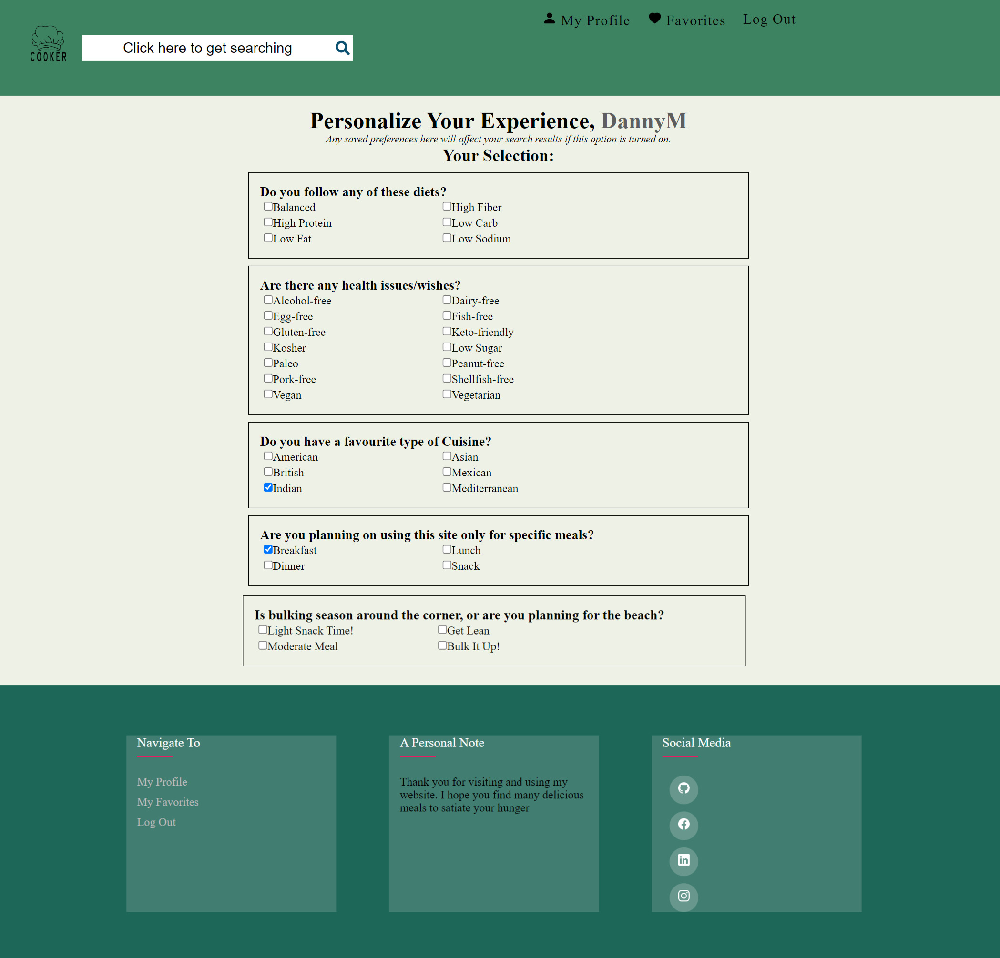

Table of Contents
1. About the application
2. Getting started.
3. Backend and API information
4. Access for users
5. Getting started with Create React App

**1. About The Application**

Cooker is a simple recipe application with an added twist. What makes Cooker different is the implementation of search results altering to your specific selection of filters. You can do this at the profile page where you then put in what diet you are following, any allergies and even if you are looking for a specific cuisine. From now on, you don’t need to keep re-selecting all these filters with every search.
Below you can see the profile page. As a registered and logged in user you can start creating your own personality.

**2. Getting Started**

Firstly, you can clone this repository by going above the list of files and clicking Code. Next copy the url for the repository and open Git Bash. Then change the current working directory to the location where you want the cloned directory.
Type `git clone`, and then paste the URL you copied earlier like down below:

`$ git clone https://github.com/YOUR-USERNAME/YOUR-REPOSITORY

`After cloning, you can install the node_modules by running the command:

`npm install`

The command npm start runs the app in the development mode.
Open https://localhost:3000 to view it in your browser.
To stop running the page in the browser, use CRT + C in the terminal.

**3. Backend and API information**

This application makes use of the Edamam API, more specifically the Recipe Search API. For this project, the free developer plan has been used. To be able to make use of this application, it would be required to do the same as it requires an app_key and an app_id.
If you are part of the select few that have the right to these keys, these will be found at the bottom of the document sent with this assignment.

The backend used for this project is an educational backend from Novi Hogeschool, meant specifically for this assignment.
https://github.com/hogeschoolnovi/novi-educational-backend-documentation

**4. Access for users**

This project only makes use of user roles.
If you are not logged in, you can still view the homepage, click on recipe’s links and go to the search page. Here you can search based on search query and add filters as you see fit.

As a registered and logged in user, additionally you can access your profile, add and remove personalized filters and make use of these while searching for recipes. Furthermore, you can access your favorites pages, but also add and remove favorites from anywhere on the page that contains recipes.
To log in, a user simply navigates from either the navigation bar or the footer to registration and log in. Here he/she will first create an account and thereafter log in using his username and password.
For the current situation, it is not yet possible to reset your password. As well, with the backend in use, the personal token and access rights expire after a couple of hours. The user will then need to redo the steps mentioned above.

**5. Getting Started with Create React App**

# Getting Started with Create React App

This project was bootstrapped with [Create React App](https://github.com/facebook/create-react-app).

## Available Scripts

In the project directory, you can run:

### `npm start`

Runs the app in the development mode.\
Open [http://localhost:3000](http://localhost:3000) to view it in your browser.

The page will reload when you make changes.\
You may also see any lint errors in the console.

### `npm test`

Launches the test runner in the interactive watch mode.\
See the section about [running tests](https://facebook.github.io/create-react-app/docs/running-tests) for more information.

### `npm run build`

Builds the app for production to the `build` folder.\
It correctly bundles React in production mode and optimizes the build for the best performance.

The build is minified and the filenames include the hashes.\
Your app is ready to be deployed!

See the section about [deployment](https://facebook.github.io/create-react-app/docs/deployment) for more information.

### `npm run eject`

**Note: this is a one-way operation. Once you `eject`, you can't go back!**

If you aren't satisfied with the build tool and configuration choices, you can `eject` at any time. This command will remove the single build dependency from your project.

Instead, it will copy all the configuration files and the transitive dependencies (webpack, Babel, ESLint, etc) right into your project so you have full control over them. All of the commands except `eject` will still work, but they will point to the copied scripts so you can tweak them. At this point you're on your own.

You don't have to ever use `eject`. The curated feature set is suitable for small and middle deployments, and you shouldn't feel obligated to use this feature. However we understand that this tool wouldn't be useful if you couldn't customize it when you are ready for it.

## Learn More

You can learn more in the [Create React App documentation](https://facebook.github.io/create-react-app/docs/getting-started).

To learn React, check out the [React documentation](https://reactjs.org/).

### Code Splitting

This section has moved here: [https://facebook.github.io/create-react-app/docs/code-splitting](https://facebook.github.io/create-react-app/docs/code-splitting)

### Analyzing the Bundle Size

This section has moved here: [https://facebook.github.io/create-react-app/docs/analyzing-the-bundle-size](https://facebook.github.io/create-react-app/docs/analyzing-the-bundle-size)

### Making a Progressive Web App

This section has moved here: [https://facebook.github.io/create-react-app/docs/making-a-progressive-web-app](https://facebook.github.io/create-react-app/docs/making-a-progressive-web-app)

### Advanced Configuration

This section has moved here: [https://facebook.github.io/create-react-app/docs/advanced-configuration](https://facebook.github.io/create-react-app/docs/advanced-configuration)

### Deployment

This section has moved here: [https://facebook.github.io/create-react-app/docs/deployment](https://facebook.github.io/create-react-app/docs/deployment)

### `npm run build` fails to minify

This section has moved here: [https://facebook.github.io/create-react-app/docs/troubleshooting#npm-run-build-fails-to-minify](https://facebook.github.io/create-react-app/docs/troubleshooting#npm-run-build-fails-to-minify)
